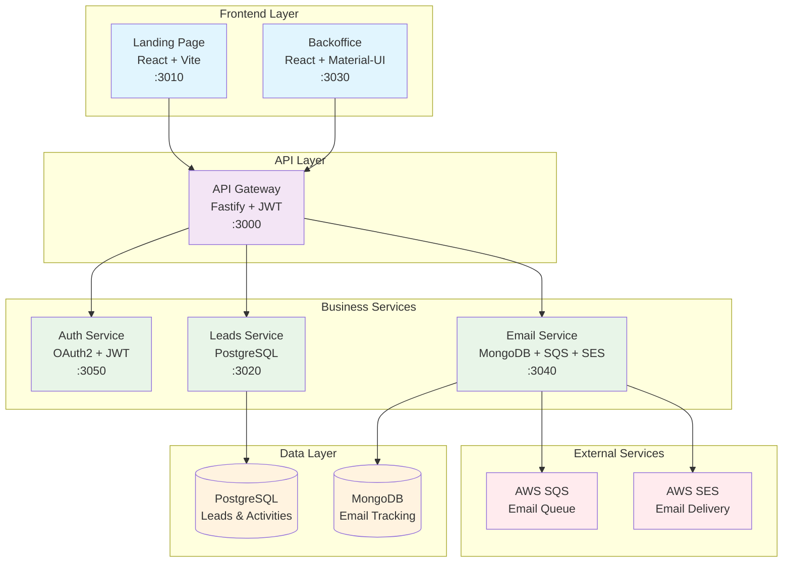
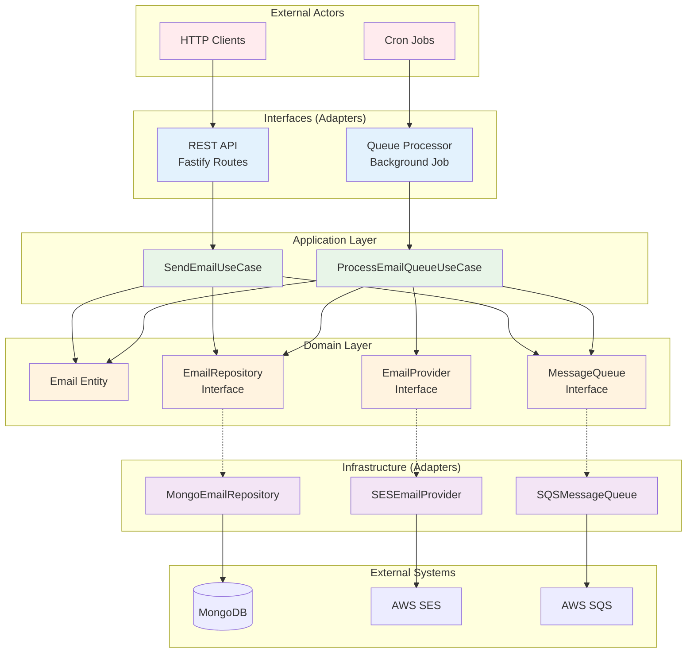
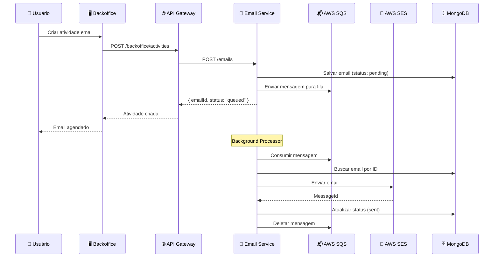
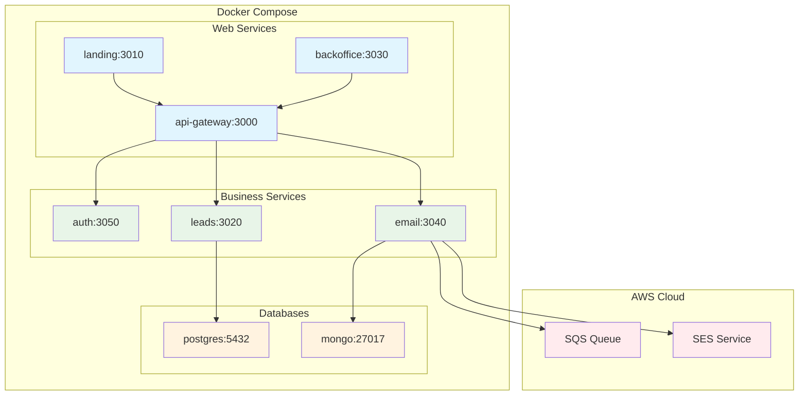
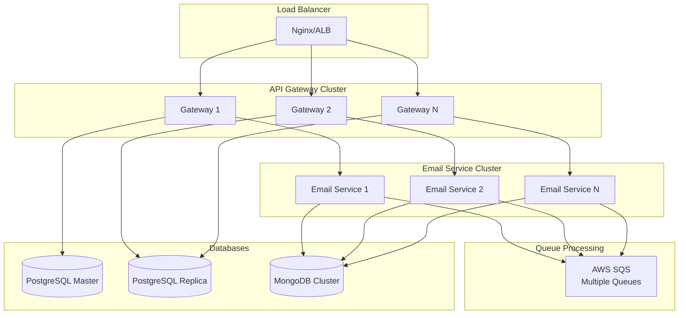

# 🏗️ Diagrama de Arquitetura do CRM

## Arquitetura Geral do Sistema



## Arquitetura Hexagonal do Email Service



## Fluxo de Dados - Envio de Email



## Estrutura de Dados

### PostgreSQL (Leads Service)
```sql
-- Leads principais
leads (
  id UUID PRIMARY KEY,
  name TEXT,
  email TEXT,
  company TEXT,
  status TEXT,
  created_at TIMESTAMP
)

-- Atividades dos leads
activities (
  id UUID PRIMARY KEY,
  lead_id UUID REFERENCES leads(id),
  type TEXT, -- call, email, meeting
  description TEXT,
  outcome TEXT,
  created_at TIMESTAMP
)

-- Pipeline de vendas
stages (
  id UUID PRIMARY KEY,
  name TEXT,
  order_no INTEGER
)
```

### MongoDB (Email Service)
```javascript
// Coleção de emails
{
  _id: "uuid",
  from: { email: "sender@crm.com", name: "CRM" },
  to: [{ email: "lead@company.com", name: "Lead" }],
  subject: "Assunto",
  htmlBody: "<html>...</html>",
  textBody: "Texto...",
  status: "sent", // pending, sent, delivered, failed
  leadId: "uuid-do-lead",
  campaignId: "uuid-da-campanha",
  priority: "normal", // low, normal, high
  createdAt: ISODate(),
  sentAt: ISODate(),
  deliveredAt: ISODate(),
  sesMessageId: "aws-ses-message-id",
  retryCount: 0,
  errorMessage: null
}
```

## Padrões de Design Aplicados

### 1. Repository Pattern
```typescript
interface EmailRepository {
  save(email: Email): Promise<void>
  findById(id: string): Promise<Email | null>
  update(email: Email): Promise<void>
}
```

### 2. Strategy Pattern
```typescript
interface EmailProvider {
  sendEmail(email: Email): Promise<string>
}

class SESEmailProvider implements EmailProvider { ... }
class SMTPEmailProvider implements EmailProvider { ... }
```

### 3. Command Pattern
```typescript
class SendEmailCommand {
  constructor(private useCase: SendEmailUseCase) {}
  
  async execute(request: SendEmailRequest): Promise<string> {
    return this.useCase.execute(request)
  }
}
```

### 4. Observer Pattern
```typescript
class EmailEventPublisher {
  private observers: EmailObserver[] = []
  
  notify(event: EmailEvent): void {
    this.observers.forEach(observer => observer.handle(event))
  }
}
```

## Deployment Architecture



## Escalabilidade e Performance

### Horizontal Scaling


## Monitoramento e Observabilidade

### Métricas Principais
- **Email Service**: Taxa de envio, falhas, latência
- **SQS**: Mensagens na fila, tempo de processamento
- **SES**: Bounces, complaints, deliverability
- **MongoDB**: Conexões, operações, latência

### Logs Estruturados
```json
{
  "timestamp": "2024-01-01T10:00:00Z",
  "service": "email-service",
  "level": "info",
  "message": "Email sent successfully",
  "emailId": "uuid",
  "leadId": "uuid",
  "sesMessageId": "aws-id",
  "duration": 150
}
```

### Health Checks
- `/health` - Status geral do serviço
- Verificação de conectividade com MongoDB
- Verificação de conectividade com SQS
- Verificação de conectividade com SES

## Segurança

### Autenticação e Autorização
- JWT tokens para autenticação
- Scopes para autorização granular
- Rate limiting por usuário/IP

### Dados Sensíveis
- Emails criptografados em repouso
- Logs sem informações pessoais
- Retenção limitada de dados

### AWS Security
- IAM roles com permissões mínimas
- VPC para isolamento de rede
- Encryption in transit e at rest