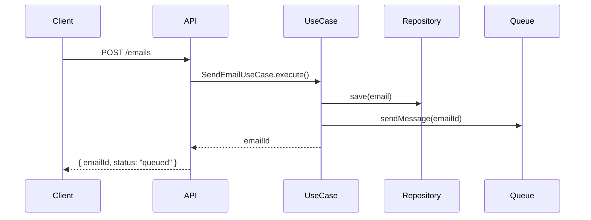
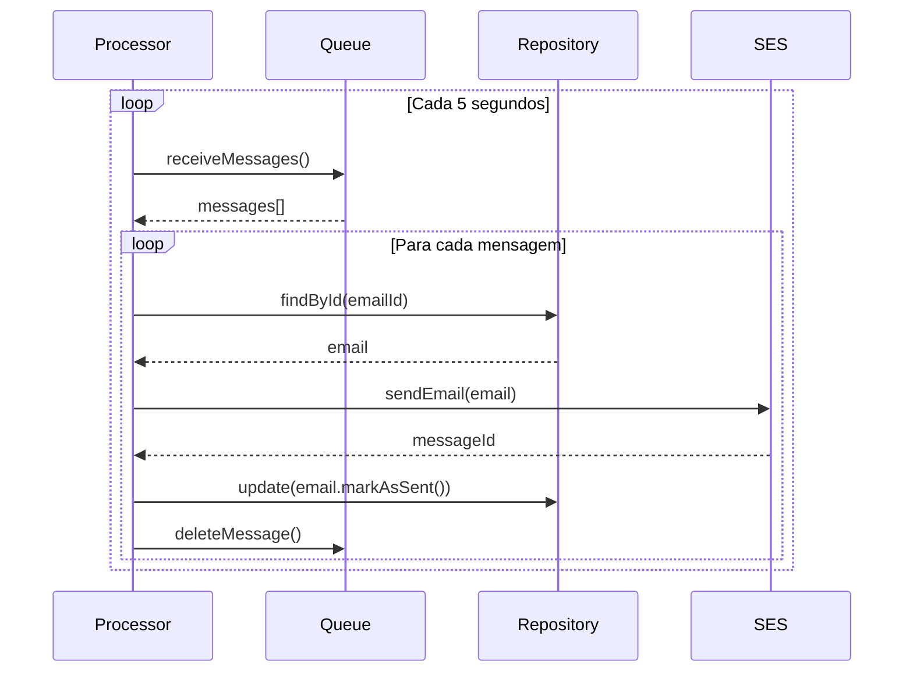

# 📧 Serviço de Email - Arquitetura Hexagonal

## Visão Geral

O serviço de email foi desenvolvido seguindo os princípios de **Arquitetura Hexagonal**, **SOLID**, **DDD** e **Clean Architecture**, integrando **AWS SES** para envio e **AWS SQS** para processamento assíncrono, com **MongoDB** para persistência.

## Arquitetura

### Camadas da Aplicação

```
src/
├── domain/                 # Camada de Domínio (Regras de Negócio)
│   ├── entities/          # Entidades de Domínio
│   ├── repositories/      # Interfaces dos Repositórios
│   └── services/          # Interfaces dos Serviços de Domínio
├── application/           # Camada de Aplicação (Casos de Uso)
│   └── usecases/         # Casos de Uso da Aplicação
├── infrastructure/       # Camada de Infraestrutura (Implementações)
│   ├── repositories/     # Implementações dos Repositórios
│   ├── email/           # Provedores de Email (SES)
│   └── messaging/       # Filas de Mensagem (SQS)
└── interfaces/          # Camada de Interface (HTTP, CLI, etc.)
    └── http/           # Controllers HTTP
```

### Princípios Aplicados

#### 1. **Hexagonal Architecture (Ports & Adapters)**
- **Portas**: Interfaces definidas no domínio (`EmailRepository`, `EmailProvider`, `MessageQueue`)
- **Adaptadores**: Implementações na infraestrutura (`MongoEmailRepository`, `SESEmailProvider`, `SQSMessageQueue`)

#### 2. **SOLID Principles**
- **S**: Cada classe tem uma responsabilidade única
- **O**: Extensível sem modificar código existente
- **L**: Implementações substituíveis pelas interfaces
- **I**: Interfaces específicas e segregadas
- **D**: Dependência de abstrações, não implementações

#### 3. **Domain-Driven Design (DDD)**
- **Entidades**: `Email` com lógica de negócio encapsulada
- **Value Objects**: `EmailAddress`, `EmailStatus`, `EmailPriority`
- **Repositórios**: Abstração para persistência
- **Serviços de Domínio**: Operações que não pertencem a entidades

#### 4. **Clean Architecture**
- **Independência de Frameworks**: Domínio não depende de tecnologias
- **Testabilidade**: Fácil criação de mocks e testes
- **Independência de UI**: Pode ser usado via HTTP, CLI, etc.
- **Independência de Banco**: Pode trocar MongoDB por outro NoSQL

## Fluxo de Funcionamento

### 1. Envio de Email


### 2. Processamento da Fila


## Componentes Principais

### Domain Layer

#### Email Entity
```typescript
class Email {
  // Propriedades imutáveis
  readonly id: string
  readonly from: EmailAddress
  readonly to: EmailAddress[]
  
  // Métodos de negócio
  markAsSent(sesMessageId: string): void
  markAsDelivered(): void
  markAsFailed(errorMessage: string): void
  canRetry(): boolean
}
```

#### Repository Interface
```typescript
interface EmailRepository {
  save(email: Email): Promise<void>
  findById(id: string): Promise<Email | null>
  findByStatus(status: EmailStatus): Promise<Email[]>
  update(email: Email): Promise<void>
}
```

### Application Layer

#### Send Email Use Case
- Cria nova entidade Email
- Persiste no repositório
- Envia para fila de processamento
- Retorna ID do email

#### Process Queue Use Case
- Consome mensagens da fila SQS
- Processa envio via SES
- Atualiza status no repositório
- Implementa retry com backoff exponencial

### Infrastructure Layer

#### MongoDB Repository
- Implementa `EmailRepository`
- Mapeia entidade para documento
- Gerencia conexão com MongoDB

#### SES Email Provider
- Implementa `EmailProvider`
- Integra com AWS SES
- Formata emails corretamente
- Adiciona tags para tracking

#### SQS Message Queue
- Implementa `MessageQueue`
- Gerencia fila de emails
- Suporte a prioridades
- Controle de visibilidade

## Configuração

### Variáveis de Ambiente
```bash
# Serviço
PORT=3040
MONGODB_URL=mongodb://mongo:27017
MONGODB_DB=crm_email

# AWS
AWS_REGION=us-east-1
AWS_ACCESS_KEY_ID=your-access-key
AWS_SECRET_ACCESS_KEY=your-secret-key
SQS_QUEUE_URL=https://sqs.us-east-1.amazonaws.com/account/queue-name
```

### Docker Compose
```yaml
email:
  build: ./services/email
  ports:
    - "3040:3040"
  environment:
    - MONGODB_URL=mongodb://mongo:27017
    - AWS_REGION=us-east-1
  depends_on:
    - mongo
```

## API Endpoints

### POST /emails
Envia um novo email para a fila de processamento.

**Request:**
```json
{
  "from": { "email": "sender@crm.com", "name": "CRM System" },
  "to": [{ "email": "lead@company.com", "name": "Lead Name" }],
  "subject": "Assunto do Email",
  "htmlBody": "<h1>Conteúdo HTML</h1>",
  "textBody": "Conteúdo em texto",
  "priority": "normal",
  "leadId": "uuid-do-lead"
}
```

**Response:**
```json
{
  "emailId": "uuid-do-email",
  "status": "queued"
}
```

### GET /emails/:id
Consulta status de um email específico.

**Response:**
```json
{
  "id": "uuid-do-email",
  "status": "sent",
  "subject": "Assunto do Email",
  "to": [{ "email": "lead@company.com" }],
  "createdAt": "2024-01-01T10:00:00Z",
  "sentAt": "2024-01-01T10:01:00Z"
}
```

### GET /emails/lead/:leadId
Lista emails enviados para um lead específico.

## Integração com CRM

### API Gateway
O API Gateway foi atualizado para incluir endpoints de email:

- `POST /backoffice/emails` - Enviar email
- `GET /backoffice/emails/lead/:leadId` - Emails do lead

### Backoffice
Novo componente `EmailManager` permite:
- Enviar emails para leads
- Visualizar histórico de emails
- Acompanhar status de entrega
- Dashboard com métricas

### Atividades
Integração automática: quando uma atividade do tipo "email" é criada, o sistema pode enviar o email automaticamente.

## Fallback e Resiliência

### Retry Logic
- Máximo 3 tentativas por email
- Backoff exponencial (1min, 2min, 4min)
- Emails marcados como "failed" após 3 falhas

### Fallback Providers
Arquitetura permite adicionar provedores alternativos:
```typescript
class FallbackEmailProvider implements EmailProvider {
  constructor(
    private primary: EmailProvider,
    private secondary: EmailProvider
  ) {}
  
  async sendEmail(email: Email): Promise<string> {
    try {
      return await this.primary.sendEmail(email)
    } catch (error) {
      return await this.secondary.sendEmail(email)
    }
  }
}
```

### Monitoring
- Logs estruturados para observabilidade
- Métricas de envio e entrega
- Health checks para dependências

## Próximos Passos

1. **Templates**: Sistema de templates de email
2. **Webhooks**: Receber eventos de entrega do SES
3. **Analytics**: Tracking de abertura e cliques
4. **Campanhas**: Envio em massa com segmentação
5. **A/B Testing**: Testes de diferentes versões
6. **Unsubscribe**: Gerenciamento de opt-out
7. **GDPR Compliance**: Controles de privacidade

## Testes

### Unit Tests
```typescript
describe('Email Entity', () => {
  it('should mark email as sent', () => {
    const email = new Email(...)
    email.markAsSent('ses-message-id')
    expect(email.status).toBe(EmailStatus.SENT)
  })
})
```

### Integration Tests
```typescript
describe('SendEmailUseCase', () => {
  it('should save email and queue message', async () => {
    const useCase = new SendEmailUseCase(mockRepo, mockQueue)
    const emailId = await useCase.execute(request)
    expect(mockRepo.save).toHaveBeenCalled()
    expect(mockQueue.sendMessage).toHaveBeenCalled()
  })
})
```

## Benefícios da Arquitetura

1. **Manutenibilidade**: Código organizado e fácil de entender
2. **Testabilidade**: Fácil criação de testes unitários
3. **Flexibilidade**: Fácil troca de provedores e tecnologias
4. **Escalabilidade**: Processamento assíncrono via filas
5. **Confiabilidade**: Retry automático e fallbacks
6. **Observabilidade**: Logs e métricas estruturadas