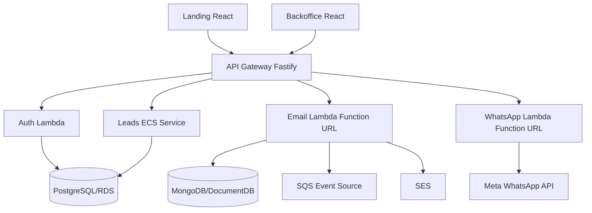

# CRM Lite

CRM simples para captura e gestao de leads, com landing page, backoffice, API Gateway e servicos de negocio em Node/Fastify.

Este README centraliza a documentacao do projeto. Evite criar novos arquivos `.md`; atualize este documento quando houver mudancas de arquitetura, deploy, manutencao ou operacao.

## Visao Geral

O sistema e organizado como monorepo com workspaces npm:

| Caminho | Responsabilidade |
| --- | --- |
| `services/landing-react` | Landing page publica para captura de leads |
| `services/backoffice-react` | Backoffice administrativo do CRM |
| `services/api-gateway` | Gateway HTTP, autenticacao de rotas e proxy para servicos internos |
| `services/auth` | Autenticacao simples/JWT publicada como Lambda Function URL |
| `services/leads` | Core do CRM: leads, pipeline, atividades e campos customizados |
| `services/email` | Envio e rastreio de emails com Lambda, SQS, SES e MongoDB/DocumentDB |
| `services/whatsapp` | Integracao WhatsApp/Meta Business API publicada como Lambda Function URL |
| `terraform` | Infraestrutura AWS atual baseada em ECS/Fargate |
| `.github/workflows` | CI/CD para build, provisionamento e deploy AWS |

## SaaS MVP

O sistema esta sendo preparado para venda como SaaS com o minimo necessario para manter o MVP em producao:

- Tenant padrao `cliente-inicial` criado no PostgreSQL.
- Usuarios legados importados para tabela `users`:
  - `admin@quiz.com` / `admin123`.
  - `user@quiz.com` / `user123`.
- Auth em Lambda valida usuarios pelo PostgreSQL e emite JWT com `tenantId`.
- API Gateway propaga `x-tenant-id` para o servico de leads.
- Leads, atividades, pipelines, etapas e campos customizados passam a ser filtrados por `tenant_id`.
- Rotas publicas da landing usam o tenant padrao enquanto houver apenas um cliente.

Limites assumidos nesta fase:

- Nao ha billing, assinatura, trial, invoice ou cobranca automatica.
- Nao ha painel de criacao de tenants; novos clientes devem ser criados por migracao/script operacional.
- Nao ha Cognito nesta fase; a autenticacao continua simples para reduzir complexidade.
- Para demo MVP, a landing publica cria leads sem login e o backoffice usa credencial demo com `mock-admin-token`.
- O escopo multi-tenant inicial e isolamento logico no banco compartilhado.
- Antes de vender para multiplos clientes simultaneos, revisar LGPD, auditoria, backup/restore por tenant, termos de uso, trilha de alteracoes e controles de suporte.

## Arquitetura Atual



Padroes mantidos:

- APIs backend com Fastify e TypeScript.
- Separacao por servico dentro de `services/*`.
- `email` segue ports/adapters: `domain`, `application`, `infrastructure`, `interfaces`.
- `leads` concentra regras operacionais do CRM e exposicao HTTP.
- Frontends sao React + Vite.
- Deploy atual empacota servicos em containers Docker e publica via ECS/Fargate.

## Arquitetura AWS Atual

O Terraform atual provisiona:

- VPC com subnets publicas e privadas.
- NAT Gateway para saida dos servicos privados.
- Application Load Balancer.
- ECS Cluster com tasks Fargate para `api-gateway` e `leads`.
- Lambda Function URL para `auth`, `email` e `whatsapp`.
- RDS PostgreSQL para leads.
- DocumentDB para emails.
- SQS e SES para email.
- ECR para imagens Docker.
- CloudWatch Logs.
- Service Discovery interno `crm.local`.

Politica de ambientes AWS:

- `main`: unico ambiente publicado na AWS, usando `prod`.
- `develop`: branch de trabalho/homologacao de codigo, sem deploy AWS automatico.
- Ambiente `dev` nao deve ser mantido na AWS nesta fase para reduzir custo.

Workflow principal:

- `.github/workflows/setup-infrastructure.yml`: provisionamento manual.
- `.github/workflows/deploy-aws.yml`: build, push de imagens, Terraform apply e migracoes.

## Arquitetura Alvo Para Reduzir Custo

Para baixo volume inicial, a arquitetura mais barata deve evoluir para:

- `landing-react` em S3 + CloudFront. **Aplicado.**
- `backoffice-react` em S3 + CloudFront. **Aplicado.**
- `email` como Lambda consumindo SQS e usando SES. **Aplicado.**
- `whatsapp` como Lambda para webhooks e envios sob demanda. **Aplicado.**
- `auth` como Lambda simples com JWT. **Aplicado.**
- `leads` pode migrar para Lambda depois, mas exige cuidado com conexoes PostgreSQL; use RDS Proxy se houver concorrencia.
- `api-gateway` pode virar AWS API Gateway/HTTP API roteando para Lambdas.

Ordem recomendada de migracao:

1. Publicar frontends estaticos em S3/CloudFront.
2. Migrar `email` para Lambda acionada por SQS.
3. Migrar `whatsapp` para Lambda Function URL ou API Gateway.
4. Migrar `auth` para Lambda simples com JWT.
5. Migrar `leads` somente depois de estabilizar banco, migracoes e conexoes.

Nesta etapa, ECS/Fargate foi mantido apenas para `api-gateway` e `leads`. `auth`, `email` e `whatsapp` foram migrados para Lambda para reduzir custo de processamento sempre ligado. Nao migre `leads` antes de validar estrategia de conexoes com PostgreSQL.

## Execucao Local

Pre-requisitos:

- Node.js 20+.
- npm 10+.
- Docker Desktop para execucao com containers.
- Git.

Instalar dependencias:

```bash
npm install
```

Rodar todos os builds:

```bash
npm run build:all
```

Rodar testes do servico de leads:

```bash
npm run test:leads
```

Subir ambiente local:

```bash
start-crm.bat
```

Parar ambiente local:

```bash
stop-crm.bat
```

Ver status:

```bash
status-crm.bat
```

URLs locais:

| Servico | URL |
| --- | --- |
| Landing | `http://localhost:3010` |
| Backoffice | `http://localhost:3030` |
| API Gateway | `http://localhost:3000` |
| Swagger | `http://localhost:3000/docs` |
| Leads | `http://localhost:3020` |
| Email | `http://localhost:3040` |
| Auth | `http://localhost:3050` |
| WhatsApp | `http://localhost:3050` |

Credenciais locais:

- Admin: `admin@quiz.com` / `admin123`.
- Token mock: `mock-admin-token`.

## Variaveis De Ambiente

Exemplo local:

```env
POSTGRES_HOST=db
POSTGRES_PORT=5432
POSTGRES_DB=quiz
POSTGRES_USER=quiz
POSTGRES_PASSWORD=quiz
DATABASE_URL=postgres://quiz:quiz@db:5432/quiz

AUTH_JWT_SECRET=changeme-dev-secret
AUTH_CLIENTS=frontend:front-secret:leads:read,leads:write,reports:read;gateway:gateway-secret:leads:read,leads:write,api:read

API_GATEWAY_PORT=3000
LANDING_PORT=3010
LEADS_PORT=3020
BACKOFFICE_PORT=3030
EMAIL_PORT=3040
AUTH_PORT=3050
WHATSAPP_PORT=3050

AWS_REGION=us-east-1
SQS_QUEUE_URL=

WHATSAPP_USE_MOCK=true
WHATSAPP_ACCESS_TOKEN=
WHATSAPP_PHONE_NUMBER_ID=
WHATSAPP_VERIFY_TOKEN=crm-whatsapp-token
```

Nunca commite `.env` real, tokens, chaves AWS ou outputs sensiveis do Terraform.

Variaveis importantes em AWS:

- `AUTH_JWT_SECRET`: trocar o valor padrao do Terraform antes de producao real.
- `AUTH_CLIENTS`: clientes OAuth simples usados pelo backoffice/gateway.
- `internal_api_token`: variavel Terraform sensivel usada como header `x-internal-api-token` entre `api-gateway` e Lambdas internas.
- `WHATSAPP_ACCESS_TOKEN` e `WHATSAPP_PHONE_NUMBER_ID`: configurar na Lambda `crm-whatsapp-prod` antes de usar Meta WhatsApp real.
- `WHATSAPP_VERIFY_TOKEN`: token usado na validacao do webhook Meta.
- `MONGODB_URL`, `MONGODB_DB`, `SQS_QUEUE_URL`: configurados pelo Terraform para a Lambda de email.
- `DEFAULT_TENANT_ID`: tenant usado por rotas publicas e tokens client credentials no MVP.

## APIs Principais

Publicas:

- `GET /health`
- `POST /api/public/leads`
- `GET /api/public/custom-fields`

Landing publica:

- Captura leads B2B por CNPJ usando `document` + `document_type='cnpj'`.
- Nao exibe botao de cadastro com Google ou login social.
- Telefone comercial deve ser aceito apenas no formato `(xx) xxxxx-xxxx`; nao aceitar DDI, telefone fixo ou mascara diferente neste fluxo.
- Campos adicionais ativos em `custom_fields` sao renderizados com o mesmo tema visual da landing.

Backoffice:

- `GET /api/backoffice/stats`
- `GET /api/backoffice/chart`
- `GET /api/backoffice/leads`
- `POST /api/backoffice/leads`
- `PUT /api/backoffice/leads/:id`
- `PUT /api/backoffice/leads/:id/move`
- `GET /api/backoffice/pipeline`
- `GET /api/backoffice/activities`
- `POST /api/backoffice/activities`
- `GET /api/backoffice/custom-fields`
- `POST /api/backoffice/custom-fields`
- `PUT /api/backoffice/custom-fields/:id`
- `DELETE /api/backoffice/custom-fields/:id`

Email:

- `POST /api/backoffice/emails`
- `GET /api/backoffice/emails/lead/:leadId`

WhatsApp:

- `POST /api/whatsapp/send-message`
- `POST /api/whatsapp/leads/:id/welcome`
- `POST /api/whatsapp/leads/:id/follow-up`
- `POST /api/whatsapp/leads/:id/qualification`

## Modelo De Dados Principal

Todas as tabelas operacionais incluem `tenant_id uuid NOT NULL REFERENCES tenants(id)` para isolamento logico por cliente SaaS. Toda chamada interna do backoffice para `leads` deve carregar `x-tenant-id`; o `api-gateway` deriva esse valor do JWT.

### Tabelas PostgreSQL

**tenants** — clientes/contas SaaS
| Coluna | Tipo | Detalhe |
| --- | --- | --- |
| id | uuid PK | gen_random_uuid() |
| name | text | nome do cliente |
| slug | text UNIQUE | identificador URL |
| status | text | active \| suspended \| cancelled |
| plan | text | starter \| professional \| enterprise |

**users** — usuarios autenticaveis, vinculados a um tenant
| Coluna | Tipo | Detalhe |
| --- | --- | --- |
| id | uuid PK | |
| tenant_id | uuid FK | |
| email | text UNIQUE | |
| role | text | admin \| user |
| password_hash | text | SHA-256 |

**leads** — cadastro central do CRM
| Coluna | Tipo | Detalhe |
| --- | --- | --- |
| id | uuid PK | |
| tenant_id | uuid FK | obrigatorio |
| name | text | nome do lead ou empresa |
| email | text | UNIQUE por tenant |
| phone | text | |
| document | varchar(18) | CPF formatado (000.000.000-00) ou CNPJ (00.000.000/0000-00) |
| document_type | varchar(10) | 'cpf' \| 'cnpj' — default 'cpf' |
| company | text | nome da empresa (B2B) |
| job_title | text | |
| cep, address_line, number, complement, neighborhood, city, state | text | endereco completo |
| monthly_income | decimal(15,2) | renda mensal (B2C) |
| lead_value | decimal(15,2) | valor estimado do negocio |
| expected_close_date | date | |
| priority | text | low \| medium \| high \| urgent |
| assigned_to | text | responsavel |
| source | text | origem do lead |
| utm_source, utm_medium, utm_campaign | text | rastreio de campanha |
| status | text | new \| contacted \| qualified \| proposal \| negotiation \| won \| lost |
| score | integer | 0-100, default 50 |
| temperature | text | cold \| warm \| hot |
| terms_accepted | boolean | |
| consent_lgpd | boolean | |
| stage_id | uuid FK | estagio atual (atalho) |
| next_follow_up | timestamptz | |
| metadata | jsonb | dados extras livres |

> **Nota B2B/B2C:** quando `document_type = 'cnpj'`, `name` e `company` representam a empresa; `document` guarda o CNPJ formatado. Para leads B2C, `document_type = 'cpf'`. O campo legado `cpf` foi removido na migration `0010_document_field.sql`; a API ainda aceita `cpf` no corpo da requisicao como alias retroativo.

**activities** — historico de interacoes
| Coluna | Tipo | Detalhe |
| --- | --- | --- |
| id | uuid PK | |
| lead_id | uuid FK | |
| tenant_id | uuid FK | |
| type | text | call \| email \| meeting \| whatsapp \| sms \| note \| task |
| subject, description | text | |
| outcome | text | interested \| not_interested \| callback \| meeting_scheduled \| no_answer \| completed \| sent \| opened \| clicked |
| duration_minutes | integer | |
| follow_up_required | boolean | |
| next_action | text | |
| created_by | text | |

**pipelines / stages / lead_pipeline** — funil de vendas
- `pipelines`: funis ativos por tenant.
- `stages`: etapas de um pipeline com `order_no`, `stage_color`, `conversion_probability`.
- `lead_pipeline`: posicao atual do lead no funil (`lead_id`, `pipeline_id`, `current_stage_id`).

**custom_fields / lead_custom_values** — campos dinamicos por tenant
| Coluna | Tipo | Detalhe |
| --- | --- | --- |
| name | varchar(100) | chave da API (snake_case) |
| label | varchar(200) | rotulo para UI |
| field_type | varchar(50) | text \| email \| phone \| number \| select \| checkbox \| textarea \| date |
| is_required | boolean | |
| options | jsonb | para campos select |
| tenant_id | uuid FK | isolamento por cliente |

Campos de contatos B2B (compras, manutencao, fiscal) sao armazenados como custom fields ativos por tenant, evitando colunas fixas para dados opcionais de contexto.

### Colecoes MongoDB/DocumentDB (servico email)

- remetente/destinatarios, assunto, corpo HTML e texto.
- status: `pending` → `sent` → `delivered` \| `failed`.
- `leadId`, `campaignId`, prioridade, tentativas e motivo de erro.

## Deploy AWS

Pre-requisitos:

1. Conta AWS ativa.
2. Usuario/role com permissoes para ECR, ECS, EC2/VPC, ELB, IAM, RDS, DocumentDB, SQS, SES, S3, CloudWatch e Service Discovery.
3. GitHub Secrets:

```text
AWS_ACCESS_KEY_ID
AWS_SECRET_ACCESS_KEY
INTERNAL_API_TOKEN
AUTH_JWT_SECRET
WHATSAPP_ACCESS_TOKEN
WHATSAPP_PHONE_NUMBER_ID
WHATSAPP_VERIFY_TOKEN
```

Provisionar infraestrutura:

1. Abrir GitHub Actions.
2. Executar `Setup AWS Infrastructure`.
3. Selecionar `prod`.
4. Aguardar Terraform finalizar.

Publicar aplicacao:

1. Fazer merge/push para `main`.
2. Acompanhar `Deploy CRM to AWS`.

Nesta fase, push para `develop` nao provisiona AWS automaticamente. Essa decisao reduz custo evitando duplicar RDS, DocumentDB, NAT Gateway, ALB, ECS/Fargate e CloudFront. Para validar uma alteracao de `develop` no ambiente compartilhado, execute manualmente o workflow `Deploy CRM to AWS` escolhendo a branch `develop`; caso contrario, apenas `main` sera publicado automaticamente.

Validacoes antes de push:

```bash
npm install
npm run build:all
npm run test:leads
```

Comandos AWS uteis:

```bash
aws ecs list-services --cluster crm-cluster-prod
aws ecs describe-services --cluster crm-cluster-prod --services crm-api-gateway-prod
aws logs tail /ecs/crm-prod --follow
aws lambda get-function --function-name crm-auth-prod
aws lambda get-function-url-config --function-name crm-whatsapp-prod
```

O webhook da Meta deve apontar para a Function URL do WhatsApp com path `/webhook`. Os demais endpoints de `auth`, `email` e `whatsapp` esperam o header interno enviado pelo `api-gateway`.

Executar migracao manual:

```bash
aws ecs run-task \
  --cluster crm-cluster-prod \
  --task-definition crm-migrate-prod \
  --launch-type FARGATE
```

Remover ambiente `dev` da AWS:

```bash
CONFIRM_DESTROY_DEV=crm-dev ./scripts/destroy-dev-environment.sh
```

O script seleciona o workspace Terraform `dev`, importa recursos conhecidos do ambiente, esvazia os buckets estaticos do `dev`, executa `terraform destroy -var="environment=dev"` e remove o workspace `dev` ao final. Nao execute comandos manuais de destroy em `prod`.

Empacotar Lambdas manualmente:

```bash
npm run build:all
bash scripts/package-lambda-services.sh
```

O Terraform espera os pacotes em `.aws/lambda/auth.zip`, `.aws/lambda/email.zip` e `.aws/lambda/whatsapp.zip`. Os workflows fazem esse empacotamento automaticamente antes do `terraform plan`.

Limpeza automatica de ALB legado:

- Os frontends antigos em ECS usavam target groups `land-*`/`back-*`.
- Como os frontends agora estao em S3 + CloudFront, o workflow executa `scripts/cleanup-legacy-alb-target-groups.sh` antes do `terraform plan`.
- Esse script remove regras antigas do listener que ainda apontem para target groups legados e evita erro `ResourceInUse: Target group is currently in use by a listener or a rule`.

## Checklist De Publicacao

Antes de considerar pronto para AWS:

- `npm run build:all` passando.
- `npm run test:leads` passando.
- Docker Desktop ou CI validando build das imagens.
- GitHub Secrets configurados.
- Bucket de estado Terraform `crm-terraform-state-us-east-1` criado ou criavel pelo workflow.
- ECR repositorios criados pelo workflow para `api-gateway` e `leads`.
- Pacotes Lambda gerados pelo workflow para `auth`, `email` e `whatsapp`.
- SES validado para dominio/remetente em producao.
- WhatsApp tokens configurados apenas em ambiente seguro.
- `AUTH_JWT_SECRET` trocado para valor seguro.
- RDS/DocumentDB sem senhas hardcoded em producao.

## Falhas Conhecidas E Correcoes

- Erro de JSON invisivel no Vite/PostCSS: verificar BOM no `package.json`.
- `whatsapp` sem `axios`: rodar `npm install` e commitar `package-lock.json`.
- Assets React 404: nao usar `base` no Vite se Nginx/ALB servem a aplicacao na raiz do target.
- Landing antiga em producao: se a tela mostrar "Abra sua conta", etapas "Dados Pessoais" ou botao Google, o ambiente esta servindo build antigo. Execute o workflow manual na branch correta ou publique `main` atualizado e aguarde invalidacao CloudFront.
- Testes importando `application/use-cases` inexistente em `leads`: os testes devem exercitar as rotas HTTP reais.
- Dockerfile com `npm install --omit=dev` antes do build TypeScript: instalar dependencias completas, buildar e depois usar `npm prune --omit=dev`.
- Lambda Function URL CORS: usar `allow_methods = ["*"]`; `OPTIONS` excede a validacao da API de Function URL.
- Lambda env vars: nao configurar `AWS_REGION`; ela e reservada pelo runtime Lambda.
- Lambda consumindo SQS: `visibility_timeout_seconds` da fila deve ser maior ou igual ao `timeout` da Lambda. Para `email`, a Lambda usa 60s e a fila `crm-email-queue-prod` usa 120s.
- Lambda `ResourceConflictException` (409) no deploy: alem de `publish = true` nas tres Lambdas e `retry_mode = "adaptive"` / `max_retries = 10` no provider AWS do Terraform, o workflow usa `concurrency` e executa `scripts/wait-lambda-updates.sh` antes do `terraform plan/apply`. Isso evita iniciar update enquanto `crm-auth-prod`, `crm-email-prod` ou `crm-whatsapp-prod` ainda estao com `LastUpdateStatus=InProgress`.
- ECS deploy: nao use apenas `aws ecs wait services-stable` sem diagnostico. O workflow usa `scripts/wait-ecs-services.sh` com timeout maior, eventos do servico e detalhes de tasks paradas.
- ECS Service Discovery DNS lag: o DNS do Cloud Map (`crm-leads-prod.crm.local`) e registrado de forma assincrona apos o ECS declarar o servico como stable; pode demorar ate 60s. O `validate-demo-mvp.sh` retenta criacao e listagem com ate 6 tentativas para absorver esse lag.
- Migracoes: o workflow usa `scripts/run-leads-migrations-task.sh`, aguarda a task Fargate terminar com polling proprio e falha se o container `leads` retornar exit code diferente de `0`. Nao use `aws ecs wait tasks-stopped` diretamente aqui; o waiter padrao pode expirar antes de um RDS recem-criado ficar pronto.
- Banco limpo para MVP: enquanto nao ha dados reais, o deploy usa `TF_VAR_database_rebuild_token="mvp1"`, `TF_VAR_reset_schema="true"`, RDS sem deletion protection e `skip_final_snapshot=true`. Alterar o token cria um novo PostgreSQL vazio e roda as seeds iniciais de `tenants`, `users` e `tenant_memberships`.
- Migration task: para reduzir falhas de rede durante bootstrap, `run-leads-migrations-task.sh` executa a task Fargate em subnets publicas com `assignPublicIp=ENABLED` e security group interno. A task e temporaria; os servicos continuam em subnets privadas. Para RDS recem-criado, `crm-migrate` usa `DB_CONNECT_MAX_RETRIES=120`, `DB_CONNECT_RETRY_DELAY_MS=5000` e registra o ultimo erro real de conexao no log.
- RDS exigindo SSL: erro `no pg_hba.conf entry ... no encryption` significa que a conexao chegou ao PostgreSQL, mas sem TLS. Em AWS, `crm-migrate`, `crm-leads` e `crm-auth` usam `PGSSLMODE=require`; o codigo Node configura `pg` com SSL quando essa variavel esta ativa.
- Bootstrap do leads: `services/leads/src/scripts/wait-for-db.ts` deve usar `DATABASE_URL`, `PGSSLMODE=require` e `DB_CONNECT_*`. Se ele usar host legado `db` ou conectar sem SSL, o ECS pode estabilizar incorretamente ou o gateway retornara `fetch failed`.
- Logs de migration: o script procura o log stream real no CloudWatch por task id e imprime os eventos durante a espera, em sucesso ou falha. `MIGRATION_WAIT_TIMEOUT_SECONDS` controla o limite total da task; ao exceder o limite, o script imprime diagnostico, para a task no ECS e falha o deploy quando `MIGRATIONS_REQUIRED=true`.
- Banco existente sem historico: `services/leads/src/scripts/migrate.ts` cria `schema_migrations`, faz baseline das migrations legadas quando detecta schema CRM existente e executa apenas a migracao SaaS pendente.
- Demo MVP: `scripts/validate-demo-mvp.sh` e o criterio final do deploy. Ele cria um lead via `/api/public/leads` e confirma leitura via `/api/backoffice/leads` com `mock-admin-token`.
- Fallback silencioso no api-gateway: a funcao `createLead` nao deve ter bloco `catch` retornando mock; erros do servico de leads devem propagar como HTTP 502 com detalhes. Qualquer rota que chame um servico interno deve falhar visivelmente, nunca com `[]` ou mock.
- Mismatch camelCase/snake_case: o api-gateway envia os campos para o servico de leads em camelCase (`birthDate`, `termsAccepted`, `consentLgpd`, `addressLine`, `monthlyIncome`); o servico de leads le do `body` em camelCase. Nao misturar convencoes entre as camadas.
- Backoffice em CloudFront: componentes React nao devem chamar `http://localhost:3000/...` diretamente. Use `services/backoffice-react/src/services/api.ts` e `getApiUrl()`, sempre com path `/api/backoffice/...`.

## Regras De Manutencao

- Trabalhe em `develop` para evolucao de codigo sem deploy AWS automatico.
- Publique AWS apenas por `main`/`prod` enquanto a reducao de custo estiver ativa.
- Leia o codigo antes de alterar comportamento.
- Preserve alteracoes locais do usuario.
- Mantenha os padroes existentes de cada servico.
- Centralize documentacao neste README.
- Evite scripts temporarios soltos na raiz.
- Para mudancas AWS, valide Dockerfile, workflow e Terraform juntos.
- Registre no PR: o que mudou, por que mudou, validacoes executadas e riscos restantes.

## Prompt Central Para IA

Use este prompt como diretriz para futuras manutencoes por IA neste repositorio.

```text
Voce esta trabalhando no CRM Lite, um monorepo SaaS MVP em Node/Fastify, React/Vite,
PostgreSQL/RDS, Terraform e AWS. Objetivo: manter o produto vendavel com baixo custo
operacional, publicando apenas prod na AWS.

=== REGRAS OBRIGATORIAS ===

- Preserve a arquitetura do monorepo em services/*.
- Centralize documentacao no README.md. Nao crie novos arquivos .md.
- Nao recrie ambiente dev na AWS.
- Mantenha frontends em S3 + CloudFront.
- Mantenha auth, email e whatsapp em Lambda enquanto o volume for baixo.
- Mantenha api-gateway e leads em ECS/Fargate ate existir plano validado para RDS Proxy.
- Toda nova coluna ou dado de cliente deve carregar tenant_id.
- Toda rota protegida deriva tenantId do JWT via api-gateway.
- Rotas publicas usam DEFAULT_TENANT_ID enquanto houver apenas um cliente.
- Nao introduza Cognito, billing ou nova plataforma sem decisao explicita.
- Antes de alterar Terraform/workflows, valide impacto em custo e deploy prod.
- Antes de finalizar: npm run build:all, npm run test:leads, terraform validate se houver .tf.
- Em AWS, toda conexao PostgreSQL deve usar `PGSSLMODE=require`; isso vale para migration, leads runtime, auth Lambda e scripts de bootstrap.
- A landing publica deve permanecer focada em captacao B2B por CNPJ. Nao reintroduza botao Google/login social sem decisao explicita.
- Na landing publica, telefone deve ser validado e mascarado exclusivamente como `(xx) xxxxx-xxxx`.
- No backoffice, toda chamada HTTP deve passar pelo `apiService` ou por `getApiUrl()`. Nunca use localhost hardcoded em componentes de tela.

=== SKILLS DE ARQUITETURA ===

Estas skills descrevem padroes obrigatorios. Aplique-as sempre que o contexto se encaixar.

--- SKILL: Convencao de Nomes entre Camadas ---
O projeto usa convencoes distintas por camada. NUNCA misture.
- API Gateway envia para o Leads Service: corpo em camelCase
  (birthDate, termsAccepted, consentLgpd, addressLine, monthlyIncome, documentType)
- Leads Service le do body: camelCase (body.birthDate, body.termsAccepted etc.)
- Banco de dados: snake_case (birth_date, terms_accepted, document_type)
- API Gateway propaga para o cliente: snake_case nos campos de resposta (lead.created_at)
Erro classico: api-gateway envia `terms_accepted` mas leads service le `body.termsAccepted`
e salva NULL silenciosamente. Sempre verifique a convencao de cada camada ao adicionar campos.

--- SKILL: Modelo de Documento (CPF/CNPJ) ---
Leads B2C usam CPF; leads B2B usam CNPJ. Campos no banco:
  document      varchar(18)  -- "000.000.000-00" ou "00.000.000/0000-00"
  document_type varchar(10)  -- 'cpf' | 'cnpj', DEFAULT 'cpf'
A API aceita tanto `document`+`document_type` (novo) quanto `cpf` (alias retroativo).
Nunca adicione campos separados `cpf` e `cnpj`; sempre use o par document/document_type.
Quando document_type = 'cnpj': `name` e `company` representam a empresa.
Campos de contato B2B (compras, manutencao, fiscal) ficam em custom_fields, nao em colunas.

--- SKILL: Isolamento Multi-Tenant ---
Toda query ao banco DEVE filtrar por tenant_id. Modelo:
  WHERE l.tenant_id = $N
O tenant_id vem sempre do header `x-tenant-id` injetado pelo api-gateway a partir do JWT.
Em rotas publicas usa DEFAULT_TENANT_ID do ambiente.
Nunca confie no tenant_id enviado pelo cliente; sempre derive do token autenticado.
Indices obrigatorios: toda tabela operacional tem (tenant_id, created_at DESC).

--- SKILL: Tratamento de Erros em Servicos Internos ---
NUNCA use bloco catch que retorna mock, [] ou dado fabricado quando um servico interno falha.
Padrao correto no api-gateway:
  try {
    const result = await fetch(LEADS_BASE_URL + '/leads', ...)
    if (!result.ok) throw new Error(`HTTP ${result.status}: ${await result.text()}`)
    return await result.json()
  } catch (err: any) {
    reply.code(502)
    return { error: 'Service unavailable', details: err.message }
  }
Retornar [] ou mock mascara falhas reais e torna deploy indetectavel. Sempre 502 com details.

--- SKILL: Retrocompatibilidade em Mudanca de Campos ---
Ao renomear ou substituir um campo (ex: cpf -> document):
1. Adicione o campo novo com ADD COLUMN IF NOT EXISTS na migration.
2. Migre os dados existentes com UPDATE ... WHERE novo_campo IS NULL.
3. Na API, aceite AMBOS os nomes: `body.document || body.cpf`.
4. Na resposta, retorne apenas o nome novo.
5. Documente o alias no README e nas Falhas Conhecidas.
Nunca quebre a API para dados existentes em producao.

--- SKILL: Pattern de Migration PostgreSQL ---
Toda migration deve ser idempotente. Modelo:
  ALTER TABLE leads ADD COLUMN IF NOT EXISTS novo_campo tipo DEFAULT valor;
  UPDATE leads SET novo_campo = valor_antigo WHERE novo_campo IS NULL;
  DO $$ BEGIN IF NOT EXISTS (SELECT 1 FROM pg_constraint WHERE conname='nome_constraint')
    THEN ALTER TABLE leads ADD CONSTRAINT nome_constraint CHECK (...); END IF; END $$;
  CREATE INDEX IF NOT EXISTS idx_nome ON tabela(colunas);
  ALTER TABLE leads DROP COLUMN IF EXISTS coluna_antiga;
Registre a nova migration no array `migrations` em services/leads/src/scripts/migrate.ts.
Nao existe rollback automatico; toda migration deve ser segura para rodar em producao com dados.

--- SKILL: Pattern de Testes Unitarios (Leads Service) ---
Testes ficam em services/leads/tests/*.test.ts.
Sempre mocke o Pool do pg no topo do arquivo, antes dos imports:
  const mockPool = { query: jest.fn() }
  jest.mock('pg', () => ({ Pool: jest.fn(() => mockPool) }))
Use buildServer() + app.inject() para testar via HTTP real (nao teste funcoes internas).
Sequencia de mockPool.query.mockResolvedValueOnce() deve espelhar EXATAMENTE a ordem
das queries no handler (INSERT leads, INSERT lead_pipeline, INSERT custom_fields, etc.).
Para testar que a query SQL usa o campo certo, inspecione mockPool.query.mock.calls[0][0]
(string SQL) e mockPool.query.mock.calls[0][1] (array de parametros).

--- SKILL: Custom Fields vs Colunas ---
Use custom fields para: dados opcionais de contexto B2B, campos que variam por cliente,
informacoes que nao precisam de index ou filtro no banco.
Use colunas para: campos universais de todos os leads, campos usados em WHERE/ORDER BY,
campos criticos para o negocio (status, score, temperature, document, company).
Contatos departamentais (compras, manutencao, fiscal) -> custom fields.
CNPJ, empresa, telefone principal -> colunas nativas.

--- SKILL: Deploy Lambda Terraform ---
Toda aws_lambda_function deve ter:
  publish = true   -- aguarda estado Active antes de prosseguir; previne ResourceConflictException
O provider AWS deve ter:
  retry_mode  = "adaptive"
  max_retries = 10
Nunca configure AWS_REGION como variavel de ambiente na Lambda; e reservada pelo runtime.
visibility_timeout_seconds da fila SQS deve ser >= timeout da Lambda que a consome.
Antes de terraform plan/apply, rode scripts/wait-lambda-updates.sh para evitar updates concorrentes em Lambdas ainda em InProgress.

--- SKILL: Validacao de Deploy ECS ---
O DNS do Cloud Map (crm-leads-prod.crm.local) e registrado assincronamente apos o ECS
declarar rolloutState=COMPLETED. Pode demorar ate 60 segundos.
Qualquer script de validacao que dependa de servicos ECS deve usar retry com sleep:
  max_attempts=12; interval=15  # 180s total para rotas criticas do demo MVP
  for attempt in $(seq 1 $max_attempts); do ... sleep $interval; done
O wait-ecs-services.sh aguarda o rollout mas NAO garante prontidao do DNS.
O leads service so deve iniciar depois de `wait-for-db.ts` conectar usando DATABASE_URL + PGSSLMODE=require.
Erros `fetch failed` no api-gateway devem incluir LEADS_BASE_URL e causa do Node (ENOTFOUND, ECONNREFUSED, ETIMEDOUT).

=== QUANDO IMPLEMENTAR ===

1. Leia o codigo existente antes de qualquer edicao (Read, Grep, Glob).
2. Aplique a menor mudanca que entregue o objetivo; nao refatore o que nao e pedido.
3. Verifique a skill aplicavel antes de escrever codigo novo.
4. Atualize README.md quando houver mudanca de arquitetura, operacao ou deploy.
5. Preserve dados existentes; migre sem perda e com retrocompatibilidade.
6. Rode build:all e test:leads antes de commitar qualquer alteracao em leads ou api-gateway.
7. Valide terraform plan localmente antes de commitar alteracoes em terraform/*.tf.
```

## Status Atual Da Preparacao AWS

Nesta branch, o projeto foi preparado para novo deploy em `prod` com:

- Build completo do monorepo validado.
- Testes de `leads` alinhados com a API real.
- Dockerfile do `whatsapp` corrigido para build TypeScript.
- Documentacao consolidada neste README.
- Codigo legado de chat/prompt fora dos workspaces removido.
- `landing-react` e `backoffice-react` publicados como sites estaticos em S3 + CloudFront, com `/api/*` roteado para o ALB.
- Imagens e servicos ECS/Fargate dos frontends removidos do deploy.
- `auth`, `email` e `whatsapp` migrados de ECS/Fargate para Lambda Function URL.
- `auth` conectado ao PostgreSQL para usuarios SaaS e emissao de JWT com tenant.
- Estrutura SaaS MVP adicionada com `tenants`, `users`, `tenant_memberships` e `tenant_id` em dados operacionais.
- ECS/Fargate reduzido para uma task por servico em `prod` nesta fase de baixo volume, com circuit breaker e rollback habilitados.
- `email` processa SQS por event source mapping, sem loop permanente em container.
- Workflow empacota Lambdas antes do Terraform e constroi imagens Docker apenas para `api-gateway` e `leads`.

Pendencia operacional:

- Validar `docker build` de `api-gateway` e `leads` em maquina/CI com Docker daemon ativo.
- Confirmar secrets AWS e variaveis sensiveis antes de publicar em producao.
- Configurar tokens reais de WhatsApp e segredo JWT seguro antes de abrir uso externo.
- Avaliar `api-gateway` como AWS HTTP API e `leads` com RDS Proxy em fases futuras.
