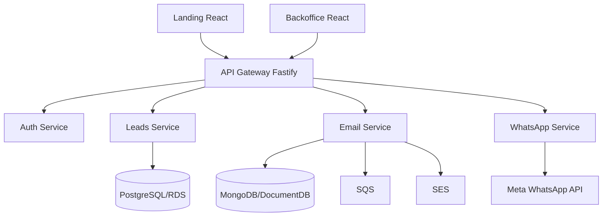

# CRM Lite

CRM simples para captura e gestao de leads, com landing page, backoffice, API Gateway e servicos de negocio em Node/Fastify.

Este README centraliza a documentacao do projeto. Evite criar novos arquivos `.md`; atualize este documento quando houver mudancas de arquitetura, deploy, manutencao ou operacao.

## Visao Geral

O sistema e organizado como monorepo com workspaces npm:

| Caminho | Responsabilidade |
| --- | --- |
| `services/landing-react` | Landing page publica para captura de leads |
| `services/backoffice-react` | Backoffice administrativo do CRM |
| `services/api-gateway` | Gateway HTTP, autenticacao de rotas e proxy para servicos internos |
| `services/auth` | Autenticacao simples/JWT para desenvolvimento e operacao inicial |
| `services/leads` | Core do CRM: leads, pipeline, atividades e campos customizados |
| `services/email` | Envio e rastreio de emails com arquitetura hexagonal, SQS/SES e MongoDB |
| `services/whatsapp` | Integracao WhatsApp/Meta Business API e mocks locais |
| `terraform` | Infraestrutura AWS atual baseada em ECS/Fargate |
| `.github/workflows` | CI/CD para build, provisionamento e deploy AWS |

## Arquitetura Atual



Padroes mantidos:

- APIs backend com Fastify e TypeScript.
- Separacao por servico dentro de `services/*`.
- `email` segue ports/adapters: `domain`, `application`, `infrastructure`, `interfaces`.
- `leads` concentra regras operacionais do CRM e exposicao HTTP.
- Frontends sao React + Vite.
- Deploy atual empacota servicos em containers Docker e publica via ECS/Fargate.

## Arquitetura AWS Atual

O Terraform atual provisiona:

- VPC com subnets publicas e privadas.
- NAT Gateway para saida dos servicos privados.
- Application Load Balancer.
- ECS Cluster com tasks Fargate.
- RDS PostgreSQL para leads.
- DocumentDB para emails.
- SQS e SES para email.
- ECR para imagens Docker.
- CloudWatch Logs.
- Service Discovery interno `crm.local`.

Branches de deploy:

- `develop`: ambiente `dev`.
- `main`: ambiente `prod`.

Workflow principal:

- `.github/workflows/setup-infrastructure.yml`: provisionamento manual.
- `.github/workflows/deploy-aws.yml`: build, push de imagens, Terraform apply e migracoes.

## Arquitetura Alvo Para Reduzir Custo

Para baixo volume inicial, a arquitetura mais barata deve evoluir para:

- `landing-react` em S3 + CloudFront.
- `backoffice-react` em S3 + CloudFront.
- `email` como Lambda consumindo SQS e usando SES.
- `whatsapp` como Lambda para webhooks e envios sob demanda.
- `auth` substituido por Cognito ou Lambda simples.
- `leads` pode migrar para Lambda depois, mas exige cuidado com conexoes PostgreSQL; use RDS Proxy se houver concorrencia.
- `api-gateway` pode virar AWS API Gateway/HTTP API roteando para Lambdas.

Ordem recomendada de migracao:

1. Publicar frontends estaticos em S3/CloudFront.
2. Migrar `email` para Lambda acionada por SQS.
3. Migrar `whatsapp` para Lambda Function URL ou API Gateway.
4. Avaliar `auth` com Cognito.
5. Migrar `leads` somente depois de estabilizar banco, migracoes e conexoes.

Nao remova ECS/Fargate ate que cada servico tenha substituto validado em `develop`.

## Execucao Local

Pre-requisitos:

- Node.js 20+.
- npm 10+.
- Docker Desktop para execucao com containers.
- Git.

Instalar dependencias:

```bash
npm install
```

Rodar todos os builds:

```bash
npm run build:all
```

Rodar testes do servico de leads:

```bash
npm run test:leads
```

Subir ambiente local:

```bash
start-crm.bat
```

Parar ambiente local:

```bash
stop-crm.bat
```

Ver status:

```bash
status-crm.bat
```

URLs locais:

| Servico | URL |
| --- | --- |
| Landing | `http://localhost:3010` |
| Backoffice | `http://localhost:3030` |
| API Gateway | `http://localhost:3000` |
| Swagger | `http://localhost:3000/docs` |
| Leads | `http://localhost:3020` |
| Email | `http://localhost:3040` |
| Auth | `http://localhost:3050` |
| WhatsApp | `http://localhost:3050` |

Credenciais locais:

- Admin: `admin@quiz.com` / `admin123`.
- Token mock: `mock-admin-token`.

## Variaveis De Ambiente

Exemplo local:

```env
POSTGRES_HOST=db
POSTGRES_PORT=5432
POSTGRES_DB=quiz
POSTGRES_USER=quiz
POSTGRES_PASSWORD=quiz
DATABASE_URL=postgres://quiz:quiz@db:5432/quiz

AUTH_JWT_SECRET=changeme-dev-secret
AUTH_CLIENTS=frontend:front-secret:leads:read,leads:write,reports:read;gateway:gateway-secret:leads:read,leads:write,api:read

API_GATEWAY_PORT=3000
LANDING_PORT=3010
LEADS_PORT=3020
BACKOFFICE_PORT=3030
EMAIL_PORT=3040
AUTH_PORT=3050
WHATSAPP_PORT=3050

AWS_REGION=us-east-1
SQS_QUEUE_URL=

WHATSAPP_USE_MOCK=true
WHATSAPP_ACCESS_TOKEN=
WHATSAPP_PHONE_NUMBER_ID=
WHATSAPP_VERIFY_TOKEN=crm-whatsapp-token
```

Nunca commite `.env` real, tokens, chaves AWS ou outputs sensiveis do Terraform.

## APIs Principais

Publicas:

- `GET /health`
- `POST /api/public/leads`
- `POST /api/public/leads/google`
- `GET /api/public/custom-fields`

Backoffice:

- `GET /api/backoffice/stats`
- `GET /api/backoffice/chart`
- `GET /api/backoffice/leads`
- `POST /api/backoffice/leads`
- `PUT /api/backoffice/leads/:id`
- `PUT /api/backoffice/leads/:id/move`
- `GET /api/backoffice/pipeline`
- `GET /api/backoffice/activities`
- `POST /api/backoffice/activities`
- `GET /api/backoffice/custom-fields`
- `POST /api/backoffice/custom-fields`
- `PUT /api/backoffice/custom-fields/:id`
- `DELETE /api/backoffice/custom-fields/:id`

Email:

- `POST /api/backoffice/emails`
- `GET /api/backoffice/emails/lead/:leadId`

WhatsApp:

- `POST /api/whatsapp/send-message`
- `POST /api/whatsapp/leads/:id/welcome`
- `POST /api/whatsapp/leads/:id/follow-up`
- `POST /api/whatsapp/leads/:id/qualification`

## Modelo De Dados Principal

Tabelas centrais do PostgreSQL:

- `leads`: cadastro, origem, status, score, temperatura, prioridade, dados comerciais e contato.
- `activities`: historico de interacoes, ligacoes, emails, reunioes, tarefas e notas.
- `pipelines`: funis ativos.
- `stages`: etapas do pipeline.
- `lead_pipeline`: posicao atual do lead no pipeline.
- `custom_fields`: campos dinamicos do formulario.
- `lead_custom_values`: valores dinamicos por lead.

Email usa MongoDB/DocumentDB para rastreio de mensagens:

- remetente/destinatarios.
- assunto e corpo.
- status `pending`, `sent`, `delivered`, `failed`.
- `leadId`, `campaignId`, prioridade, tentativas e erro.

## Deploy AWS

Pre-requisitos:

1. Conta AWS ativa.
2. Usuario/role com permissoes para ECR, ECS, EC2/VPC, ELB, IAM, RDS, DocumentDB, SQS, SES, S3, CloudWatch e Service Discovery.
3. GitHub Secrets:

```text
AWS_ACCESS_KEY_ID
AWS_SECRET_ACCESS_KEY
```

Provisionar infraestrutura:

1. Abrir GitHub Actions.
2. Executar `Setup AWS Infrastructure`.
3. Selecionar `dev` ou `prod`.
4. Aguardar Terraform finalizar.

Publicar aplicacao:

1. Fazer push para `develop` para ambiente dev.
2. Fazer push para `main` para ambiente prod.
3. Acompanhar `Deploy CRM to AWS`.

Validacoes antes de push:

```bash
npm install
npm run build:all
npm run test:leads
```

Comandos AWS uteis:

```bash
aws ecs list-services --cluster crm-cluster-dev
aws ecs describe-services --cluster crm-cluster-dev --services crm-api-gateway-dev
aws logs tail /ecs/crm-dev --follow
```

Executar migracao manual:

```bash
aws ecs run-task \
  --cluster crm-cluster-dev \
  --task-definition crm-migrate-dev \
  --launch-type FARGATE
```

## Checklist De Publicacao

Antes de considerar pronto para AWS:

- `npm run build:all` passando.
- `npm run test:leads` passando.
- Docker Desktop ou CI validando build das imagens.
- GitHub Secrets configurados.
- Bucket de estado Terraform `crm-terraform-state-us-east-1` criado ou criavel pelo workflow.
- ECR repositorios criados pelo workflow.
- SES validado para dominio/remetente em producao.
- WhatsApp tokens configurados apenas em ambiente seguro.
- `AUTH_JWT_SECRET` trocado para valor seguro.
- RDS/DocumentDB sem senhas hardcoded em producao.

## Falhas Conhecidas E Correcoes

- Erro de JSON invisivel no Vite/PostCSS: verificar BOM no `package.json`.
- `whatsapp` sem `axios`: rodar `npm install` e commitar `package-lock.json`.
- Assets React 404: nao usar `base` no Vite se Nginx/ALB servem a aplicacao na raiz do target.
- Testes importando `application/use-cases` inexistente em `leads`: os testes devem exercitar as rotas HTTP reais.
- Dockerfile com `npm install --omit=dev` antes do build TypeScript: instalar dependencias completas, buildar e depois usar `npm prune --omit=dev`.

## Regras De Manutencao

- Trabalhe em `develop` para homologacao.
- Leia o codigo antes de alterar comportamento.
- Preserve alteracoes locais do usuario.
- Mantenha os padroes existentes de cada servico.
- Centralize documentacao neste README.
- Evite scripts temporarios soltos na raiz.
- Para mudancas AWS, valide Dockerfile, workflow e Terraform juntos.
- Registre no PR: o que mudou, por que mudou, validacoes executadas e riscos restantes.

## Status Atual Da Preparacao AWS

Nesta branch, o projeto foi preparado para novo deploy em `develop` com:

- Build completo do monorepo validado.
- Testes de `leads` alinhados com a API real.
- Dockerfile do `whatsapp` corrigido para build TypeScript.
- Documentacao consolidada neste README.
- Codigo legado de chat/prompt fora dos workspaces removido.

Pendencia operacional:

- Validar `docker build` de todos os servicos em maquina/CI com Docker daemon ativo.
- Confirmar secrets AWS e variaveis sensiveis antes de publicar em producao.
