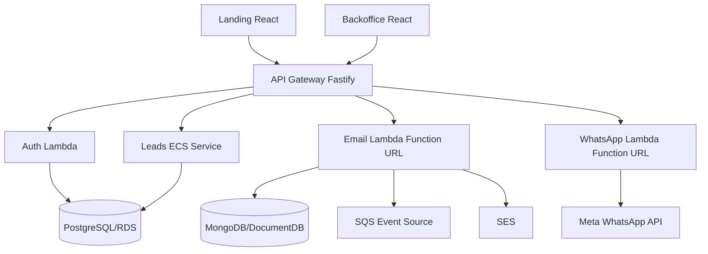

# CRM Lite

CRM simples para captura e gestao de leads, com landing page, backoffice, API Gateway e servicos de negocio em Node/Fastify.

Este README centraliza a documentacao do projeto. Evite criar novos arquivos `.md`; atualize este documento quando houver mudancas de arquitetura, deploy, manutencao ou operacao.

## Visao Geral

O sistema e organizado como monorepo com workspaces npm:

| Caminho | Responsabilidade |
| --- | --- |
| `services/landing-react` | Landing page publica para captura de leads |
| `services/backoffice-react` | Backoffice administrativo do CRM |
| `services/api-gateway` | Gateway HTTP, autenticacao de rotas e proxy para servicos internos |
| `services/auth` | Autenticacao simples/JWT publicada como Lambda Function URL |
| `services/leads` | Core do CRM: leads, pipeline, atividades e campos customizados |
| `services/email` | Envio e rastreio de emails com Lambda, SQS, SES e MongoDB/DocumentDB |
| `services/whatsapp` | Integracao WhatsApp/Meta Business API publicada como Lambda Function URL |
| `terraform` | Infraestrutura AWS atual baseada em ECS/Fargate |
| `.github/workflows` | CI/CD para build, provisionamento e deploy AWS |

## SaaS MVP

O sistema esta sendo preparado para venda como SaaS com o minimo necessario para manter o MVP em producao:

- Tenant padrao `cliente-inicial` criado no PostgreSQL.
- Usuarios legados importados para tabela `users`:
  - `admin@quiz.com` / `admin123`.
  - `user@quiz.com` / `user123`.
- Auth em Lambda valida usuarios pelo PostgreSQL e emite JWT com `tenantId`.
- API Gateway propaga `x-tenant-id` para o servico de leads.
- Leads, atividades, pipelines, etapas e campos customizados passam a ser filtrados por `tenant_id`.
- Rotas publicas da landing usam o tenant padrao enquanto houver apenas um cliente.

Limites assumidos nesta fase:

- Nao ha billing, assinatura, trial, invoice ou cobranca automatica.
- Nao ha painel de criacao de tenants; novos clientes devem ser criados por migracao/script operacional.
- Nao ha Cognito nesta fase; a autenticacao continua simples para reduzir complexidade.
- O escopo multi-tenant inicial e isolamento logico no banco compartilhado.
- Antes de vender para multiplos clientes simultaneos, revisar LGPD, auditoria, backup/restore por tenant, termos de uso, trilha de alteracoes e controles de suporte.

## Arquitetura Atual



Padroes mantidos:

- APIs backend com Fastify e TypeScript.
- Separacao por servico dentro de `services/*`.
- `email` segue ports/adapters: `domain`, `application`, `infrastructure`, `interfaces`.
- `leads` concentra regras operacionais do CRM e exposicao HTTP.
- Frontends sao React + Vite.
- Deploy atual empacota servicos em containers Docker e publica via ECS/Fargate.

## Arquitetura AWS Atual

O Terraform atual provisiona:

- VPC com subnets publicas e privadas.
- NAT Gateway para saida dos servicos privados.
- Application Load Balancer.
- ECS Cluster com tasks Fargate para `api-gateway` e `leads`.
- Lambda Function URL para `auth`, `email` e `whatsapp`.
- RDS PostgreSQL para leads.
- DocumentDB para emails.
- SQS e SES para email.
- ECR para imagens Docker.
- CloudWatch Logs.
- Service Discovery interno `crm.local`.

Politica de ambientes AWS:

- `main`: unico ambiente publicado na AWS, usando `prod`.
- `develop`: branch de trabalho/homologacao de codigo, sem deploy AWS automatico.
- Ambiente `dev` nao deve ser mantido na AWS nesta fase para reduzir custo.

Workflow principal:

- `.github/workflows/setup-infrastructure.yml`: provisionamento manual.
- `.github/workflows/deploy-aws.yml`: build, push de imagens, Terraform apply e migracoes.

## Arquitetura Alvo Para Reduzir Custo

Para baixo volume inicial, a arquitetura mais barata deve evoluir para:

- `landing-react` em S3 + CloudFront. **Aplicado.**
- `backoffice-react` em S3 + CloudFront. **Aplicado.**
- `email` como Lambda consumindo SQS e usando SES. **Aplicado.**
- `whatsapp` como Lambda para webhooks e envios sob demanda. **Aplicado.**
- `auth` como Lambda simples com JWT. **Aplicado.**
- `leads` pode migrar para Lambda depois, mas exige cuidado com conexoes PostgreSQL; use RDS Proxy se houver concorrencia.
- `api-gateway` pode virar AWS API Gateway/HTTP API roteando para Lambdas.

Ordem recomendada de migracao:

1. Publicar frontends estaticos em S3/CloudFront.
2. Migrar `email` para Lambda acionada por SQS.
3. Migrar `whatsapp` para Lambda Function URL ou API Gateway.
4. Migrar `auth` para Lambda simples com JWT.
5. Migrar `leads` somente depois de estabilizar banco, migracoes e conexoes.

Nesta etapa, ECS/Fargate foi mantido apenas para `api-gateway` e `leads`. `auth`, `email` e `whatsapp` foram migrados para Lambda para reduzir custo de processamento sempre ligado. Nao migre `leads` antes de validar estrategia de conexoes com PostgreSQL.

## Execucao Local

Pre-requisitos:

- Node.js 20+.
- npm 10+.
- Docker Desktop para execucao com containers.
- Git.

Instalar dependencias:

```bash
npm install
```

Rodar todos os builds:

```bash
npm run build:all
```

Rodar testes do servico de leads:

```bash
npm run test:leads
```

Subir ambiente local:

```bash
start-crm.bat
```

Parar ambiente local:

```bash
stop-crm.bat
```

Ver status:

```bash
status-crm.bat
```

URLs locais:

| Servico | URL |
| --- | --- |
| Landing | `http://localhost:3010` |
| Backoffice | `http://localhost:3030` |
| API Gateway | `http://localhost:3000` |
| Swagger | `http://localhost:3000/docs` |
| Leads | `http://localhost:3020` |
| Email | `http://localhost:3040` |
| Auth | `http://localhost:3050` |
| WhatsApp | `http://localhost:3050` |

Credenciais locais:

- Admin: `admin@quiz.com` / `admin123`.
- Token mock: `mock-admin-token`.

## Variaveis De Ambiente

Exemplo local:

```env
POSTGRES_HOST=db
POSTGRES_PORT=5432
POSTGRES_DB=quiz
POSTGRES_USER=quiz
POSTGRES_PASSWORD=quiz
DATABASE_URL=postgres://quiz:quiz@db:5432/quiz

AUTH_JWT_SECRET=changeme-dev-secret
AUTH_CLIENTS=frontend:front-secret:leads:read,leads:write,reports:read;gateway:gateway-secret:leads:read,leads:write,api:read

API_GATEWAY_PORT=3000
LANDING_PORT=3010
LEADS_PORT=3020
BACKOFFICE_PORT=3030
EMAIL_PORT=3040
AUTH_PORT=3050
WHATSAPP_PORT=3050

AWS_REGION=us-east-1
SQS_QUEUE_URL=

WHATSAPP_USE_MOCK=true
WHATSAPP_ACCESS_TOKEN=
WHATSAPP_PHONE_NUMBER_ID=
WHATSAPP_VERIFY_TOKEN=crm-whatsapp-token
```

Nunca commite `.env` real, tokens, chaves AWS ou outputs sensiveis do Terraform.

Variaveis importantes em AWS:

- `AUTH_JWT_SECRET`: trocar o valor padrao do Terraform antes de producao real.
- `AUTH_CLIENTS`: clientes OAuth simples usados pelo backoffice/gateway.
- `internal_api_token`: variavel Terraform sensivel usada como header `x-internal-api-token` entre `api-gateway` e Lambdas internas.
- `WHATSAPP_ACCESS_TOKEN` e `WHATSAPP_PHONE_NUMBER_ID`: configurar na Lambda `crm-whatsapp-prod` antes de usar Meta WhatsApp real.
- `WHATSAPP_VERIFY_TOKEN`: token usado na validacao do webhook Meta.
- `MONGODB_URL`, `MONGODB_DB`, `SQS_QUEUE_URL`: configurados pelo Terraform para a Lambda de email.
- `DEFAULT_TENANT_ID`: tenant usado por rotas publicas e tokens client credentials no MVP.

## APIs Principais

Publicas:

- `GET /health`
- `POST /api/public/leads`
- `POST /api/public/leads/google`
- `GET /api/public/custom-fields`

Backoffice:

- `GET /api/backoffice/stats`
- `GET /api/backoffice/chart`
- `GET /api/backoffice/leads`
- `POST /api/backoffice/leads`
- `PUT /api/backoffice/leads/:id`
- `PUT /api/backoffice/leads/:id/move`
- `GET /api/backoffice/pipeline`
- `GET /api/backoffice/activities`
- `POST /api/backoffice/activities`
- `GET /api/backoffice/custom-fields`
- `POST /api/backoffice/custom-fields`
- `PUT /api/backoffice/custom-fields/:id`
- `DELETE /api/backoffice/custom-fields/:id`

Email:

- `POST /api/backoffice/emails`
- `GET /api/backoffice/emails/lead/:leadId`

WhatsApp:

- `POST /api/whatsapp/send-message`
- `POST /api/whatsapp/leads/:id/welcome`
- `POST /api/whatsapp/leads/:id/follow-up`
- `POST /api/whatsapp/leads/:id/qualification`

## Modelo De Dados Principal

Tabelas centrais do PostgreSQL:

- `tenants`: clientes/contas SaaS.
- `users`: usuarios autenticaveis, vinculados a um tenant.
- `tenant_memberships`: vinculo usuario-tenant para evolucao de permissoes.
- `leads`: cadastro, origem, status, score, temperatura, prioridade, dados comerciais e contato.
- `activities`: historico de interacoes, ligacoes, emails, reunioes, tarefas e notas.
- `pipelines`: funis ativos.
- `stages`: etapas do pipeline.
- `lead_pipeline`: posicao atual do lead no pipeline.
- `custom_fields`: campos dinamicos do formulario.
- `lead_custom_values`: valores dinamicos por lead.

No MVP SaaS, as tabelas operacionais usam `tenant_id` para isolamento logico. Toda chamada interna do backoffice para `leads` deve carregar `x-tenant-id`; o `api-gateway` deriva esse valor do JWT.

Email usa MongoDB/DocumentDB para rastreio de mensagens:

- remetente/destinatarios.
- assunto e corpo.
- status `pending`, `sent`, `delivered`, `failed`.
- `leadId`, `campaignId`, prioridade, tentativas e erro.

## Deploy AWS

Pre-requisitos:

1. Conta AWS ativa.
2. Usuario/role com permissoes para ECR, ECS, EC2/VPC, ELB, IAM, RDS, DocumentDB, SQS, SES, S3, CloudWatch e Service Discovery.
3. GitHub Secrets:

```text
AWS_ACCESS_KEY_ID
AWS_SECRET_ACCESS_KEY
INTERNAL_API_TOKEN
AUTH_JWT_SECRET
WHATSAPP_ACCESS_TOKEN
WHATSAPP_PHONE_NUMBER_ID
WHATSAPP_VERIFY_TOKEN
```

Provisionar infraestrutura:

1. Abrir GitHub Actions.
2. Executar `Setup AWS Infrastructure`.
3. Selecionar `prod`.
4. Aguardar Terraform finalizar.

Publicar aplicacao:

1. Fazer merge/push para `main`.
2. Acompanhar `Deploy CRM to AWS`.

Nesta fase, push para `develop` nao provisiona AWS. Essa decisao reduz custo evitando duplicar RDS, DocumentDB, NAT Gateway, ALB, ECS/Fargate e CloudFront.

Validacoes antes de push:

```bash
npm install
npm run build:all
npm run test:leads
```

Comandos AWS uteis:

```bash
aws ecs list-services --cluster crm-cluster-prod
aws ecs describe-services --cluster crm-cluster-prod --services crm-api-gateway-prod
aws logs tail /ecs/crm-prod --follow
aws lambda get-function --function-name crm-auth-prod
aws lambda get-function-url-config --function-name crm-whatsapp-prod
```

O webhook da Meta deve apontar para a Function URL do WhatsApp com path `/webhook`. Os demais endpoints de `auth`, `email` e `whatsapp` esperam o header interno enviado pelo `api-gateway`.

Executar migracao manual:

```bash
aws ecs run-task \
  --cluster crm-cluster-prod \
  --task-definition crm-migrate-prod \
  --launch-type FARGATE
```

Remover ambiente `dev` da AWS:

```bash
CONFIRM_DESTROY_DEV=crm-dev ./scripts/destroy-dev-environment.sh
```

O script seleciona o workspace Terraform `dev`, importa recursos conhecidos do ambiente, esvazia os buckets estaticos do `dev`, executa `terraform destroy -var="environment=dev"` e remove o workspace `dev` ao final. Nao execute comandos manuais de destroy em `prod`.

Empacotar Lambdas manualmente:

```bash
npm run build:all
bash scripts/package-lambda-services.sh
```

O Terraform espera os pacotes em `.aws/lambda/auth.zip`, `.aws/lambda/email.zip` e `.aws/lambda/whatsapp.zip`. Os workflows fazem esse empacotamento automaticamente antes do `terraform plan`.

Limpeza automatica de ALB legado:

- Os frontends antigos em ECS usavam target groups `land-*`/`back-*`.
- Como os frontends agora estao em S3 + CloudFront, o workflow executa `scripts/cleanup-legacy-alb-target-groups.sh` antes do `terraform plan`.
- Esse script remove regras antigas do listener que ainda apontem para target groups legados e evita erro `ResourceInUse: Target group is currently in use by a listener or a rule`.

## Checklist De Publicacao

Antes de considerar pronto para AWS:

- `npm run build:all` passando.
- `npm run test:leads` passando.
- Docker Desktop ou CI validando build das imagens.
- GitHub Secrets configurados.
- Bucket de estado Terraform `crm-terraform-state-us-east-1` criado ou criavel pelo workflow.
- ECR repositorios criados pelo workflow para `api-gateway` e `leads`.
- Pacotes Lambda gerados pelo workflow para `auth`, `email` e `whatsapp`.
- SES validado para dominio/remetente em producao.
- WhatsApp tokens configurados apenas em ambiente seguro.
- `AUTH_JWT_SECRET` trocado para valor seguro.
- RDS/DocumentDB sem senhas hardcoded em producao.

## Falhas Conhecidas E Correcoes

- Erro de JSON invisivel no Vite/PostCSS: verificar BOM no `package.json`.
- `whatsapp` sem `axios`: rodar `npm install` e commitar `package-lock.json`.
- Assets React 404: nao usar `base` no Vite se Nginx/ALB servem a aplicacao na raiz do target.
- Testes importando `application/use-cases` inexistente em `leads`: os testes devem exercitar as rotas HTTP reais.
- Dockerfile com `npm install --omit=dev` antes do build TypeScript: instalar dependencias completas, buildar e depois usar `npm prune --omit=dev`.
- Lambda Function URL CORS: usar `allow_methods = ["*"]`; `OPTIONS` excede a validacao da API de Function URL.
- Lambda env vars: nao configurar `AWS_REGION`; ela e reservada pelo runtime Lambda.
- Lambda consumindo SQS: `visibility_timeout_seconds` da fila deve ser maior ou igual ao `timeout` da Lambda. Para `email`, a Lambda usa 60s e a fila `crm-email-queue-prod` usa 120s.

## Regras De Manutencao

- Trabalhe em `develop` para evolucao de codigo sem deploy AWS automatico.
- Publique AWS apenas por `main`/`prod` enquanto a reducao de custo estiver ativa.
- Leia o codigo antes de alterar comportamento.
- Preserve alteracoes locais do usuario.
- Mantenha os padroes existentes de cada servico.
- Centralize documentacao neste README.
- Evite scripts temporarios soltos na raiz.
- Para mudancas AWS, valide Dockerfile, workflow e Terraform juntos.
- Registre no PR: o que mudou, por que mudou, validacoes executadas e riscos restantes.

## Prompt Central Para IA

Use este prompt como diretriz para futuras manutencoes por IA neste repositorio:

```text
Voce esta trabalhando no CRM Lite, um monorepo SaaS MVP em Node/Fastify, React/Vite, PostgreSQL/RDS, Terraform e AWS.

Objetivo atual: manter o produto vendavel com baixo custo operacional, publicando apenas prod na AWS e evitando complexidade que nao seja necessaria para o primeiro cliente.

Regras obrigatorias:
- Preserve a arquitetura do monorepo em services/*.
- Centralize documentacao no README.md.
- Nao recrie ambiente dev na AWS.
- Mantenha frontends em S3 + CloudFront.
- Mantenha auth, email e whatsapp em Lambda enquanto o volume for baixo.
- Mantenha api-gateway e leads em ECS/Fargate ate existir plano validado para conexoes PostgreSQL/RDS Proxy.
- Toda nova funcionalidade de dado de cliente deve carregar tenant_id e respeitar isolamento por tenant.
- Toda rota protegida deve derivar tenantId do JWT pelo api-gateway.
- Rotas publicas podem usar DEFAULT_TENANT_ID enquanto houver apenas um cliente.
- Nao introduza Cognito, billing ou nova plataforma de mensageria sem decisao explicita.
- Antes de alterar Terraform/workflows, valide impacto em custo e deploy prod.
- Antes de finalizar, rode build, testes relevantes e terraform validate quando houver alteracao de infraestrutura.

Quando implementar:
1. Leia o codigo existente antes de editar.
2. Aplique a menor mudanca que entregue o objetivo.
3. Atualize README.md quando houver mudanca de arquitetura, operacao ou deploy.
4. Preserve dados existentes e migre usuarios/dados legados sem perda.
5. Documente riscos restantes de SaaS, seguranca e operacao.
```

## Status Atual Da Preparacao AWS

Nesta branch, o projeto foi preparado para novo deploy em `prod` com:

- Build completo do monorepo validado.
- Testes de `leads` alinhados com a API real.
- Dockerfile do `whatsapp` corrigido para build TypeScript.
- Documentacao consolidada neste README.
- Codigo legado de chat/prompt fora dos workspaces removido.
- `landing-react` e `backoffice-react` publicados como sites estaticos em S3 + CloudFront, com `/api/*` roteado para o ALB.
- Imagens e servicos ECS/Fargate dos frontends removidos do deploy.
- `auth`, `email` e `whatsapp` migrados de ECS/Fargate para Lambda Function URL.
- `auth` conectado ao PostgreSQL para usuarios SaaS e emissao de JWT com tenant.
- Estrutura SaaS MVP adicionada com `tenants`, `users`, `tenant_memberships` e `tenant_id` em dados operacionais.
- `email` processa SQS por event source mapping, sem loop permanente em container.
- Workflow empacota Lambdas antes do Terraform e constroi imagens Docker apenas para `api-gateway` e `leads`.

Pendencia operacional:

- Validar `docker build` de `api-gateway` e `leads` em maquina/CI com Docker daemon ativo.
- Confirmar secrets AWS e variaveis sensiveis antes de publicar em producao.
- Configurar tokens reais de WhatsApp e segredo JWT seguro antes de abrir uso externo.
- Avaliar `api-gateway` como AWS HTTP API e `leads` com RDS Proxy em fases futuras.
